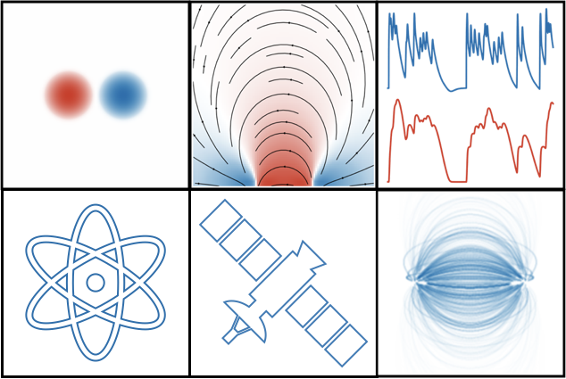

<div align="center">
  <br>
</div>

# synthesizAR
[](http://www.sunpy.org)
[](https://travis-ci.org/wtbarnes/synthesizAR)
[](http://synthesizar.readthedocs.io/en/latest/?badge=latest)


synthesizAR is a Python package for forward modeling emission from solar active regions using hydrodynamic simulations of coronal loops

## Dependencies
The easiest way to install these packages is with the [Anaconda Python distribution](https://www.anaconda.com/distribution/). To create a new environment with all of the needed dependencies, use the [environment file included in this repo](conda_environment.yml).
```
$ conda env create -f environment.yml
$ source activate synthesizar
```

## Install
After installing all of the needed dependencies, clone and install the package,
```shell
$ git clone https://github.com/wtbarnes/synthesizAR.git
$ cd synthesizAR && python setup.py install
```

## Help
See the [docs](http://synthesizar.readthedocs.io). To report bugs or request features, create an issue or submit a pull request.